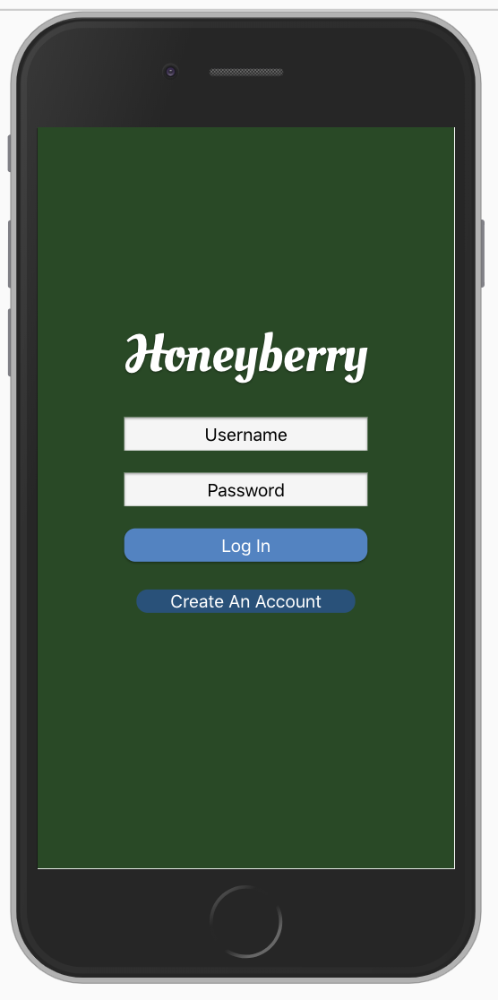
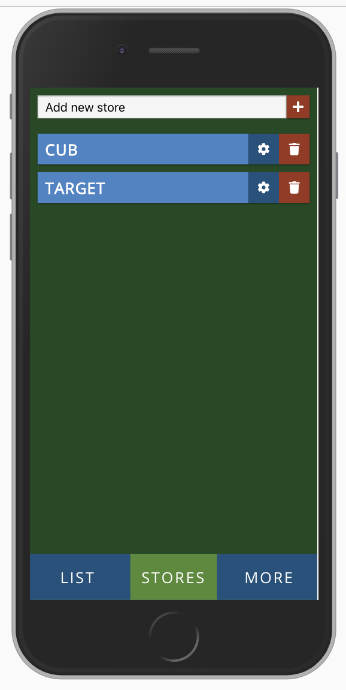
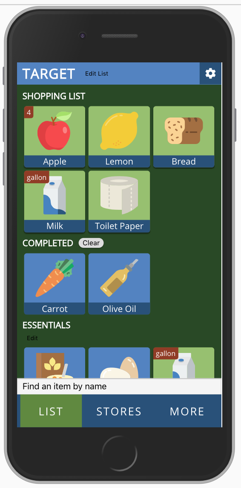
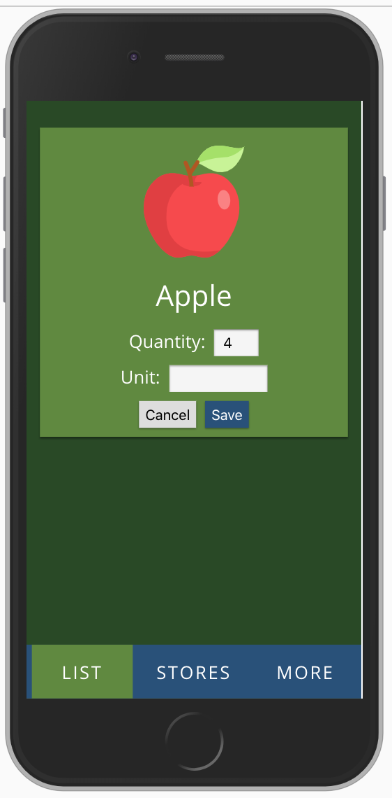
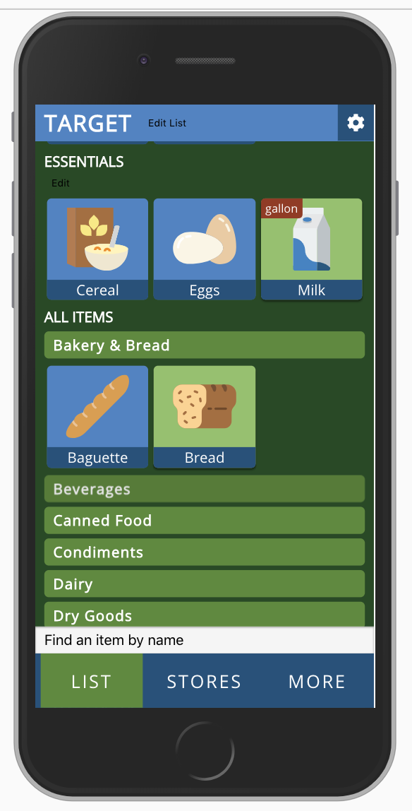
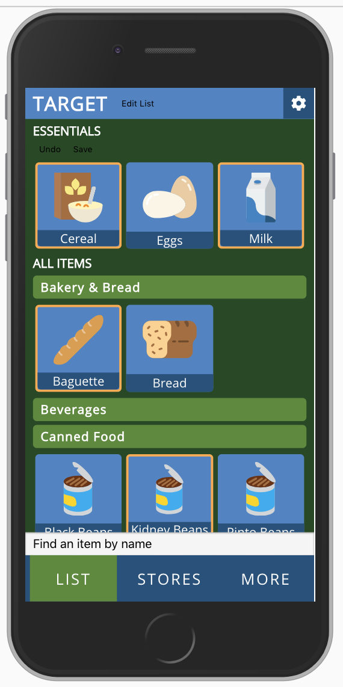
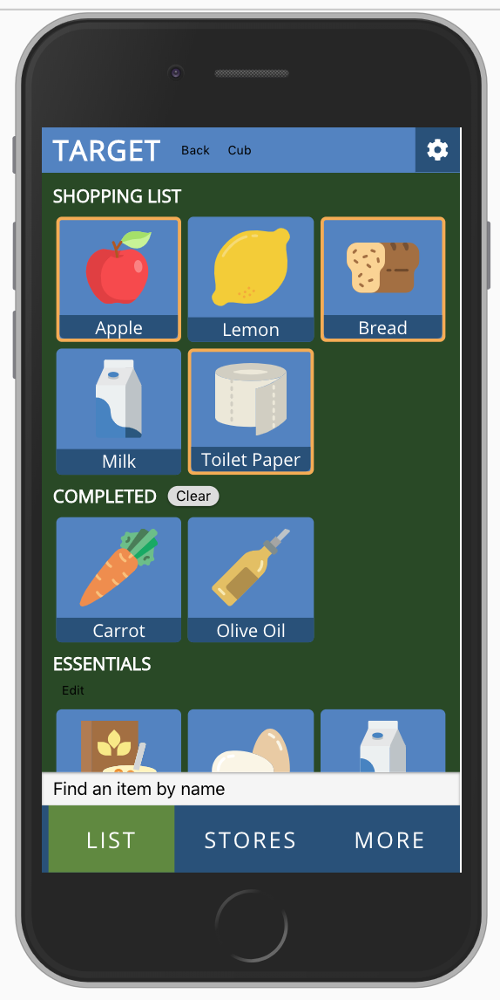
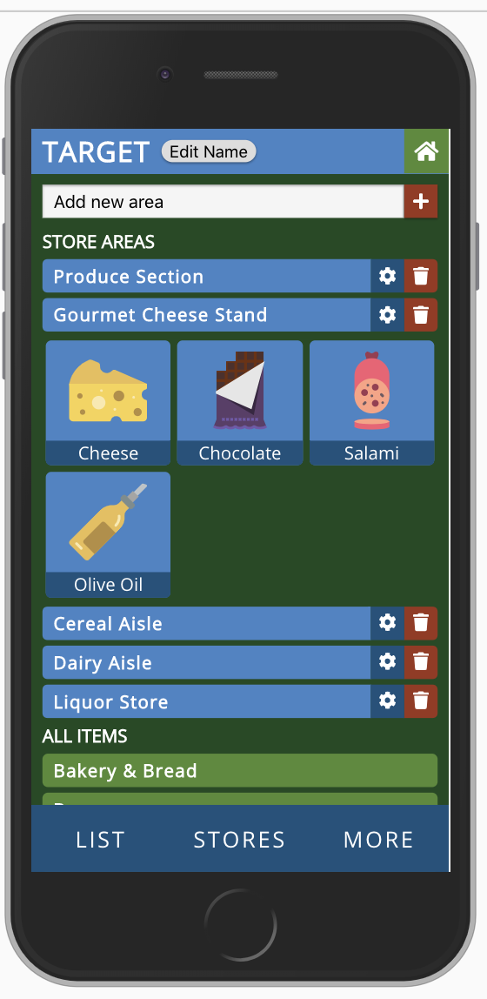

# Honeyberry
Honeyberry is a mobile-first, progressive web app designed to save people time while shopping for groceries.

## Built With
React, Redux, React Router, Redux-Saga, Node.js, Express, PostgreSQL, HTML, CSS, and food icons from flaticon.com. All of the styling was custom-made using styled-components to create a custom library of encapsulated, reusable, styled elements.

## The problem
When shopping for groceries, shoppers often have long lists of items to get, and usually in no particular order. It's easy to forget to grab something that's at the front of the store, but at the bottom of your list. 

Some grocery list apps make it possible to sort lists by item type or other parameters, but, for yours, I've wanted an app that will organize my list based on how I, personally, like to move through a particular store.

## The solution
So for my solo project at Prime Digital Academy, I decided to create Honeyberry, a mobile-first, progressive web app designed to give shoppers control over how their lists are sorted by allowing them to maintain custom sorting "areas" representing specific sections of a store, the items in those sections, and the order in which a shopper likes to move through those sections.

## Installation/Setup
If you would like to set up this application on your local machine, first clone this repository:
```bash
mkdir honeyberry
cd honeyberry
git clone https://github.com/pheggeseth/honeyberry
npm install
```
You will then need to set up the database in PostgreSQL. If you don't have PostgreSQL installed on your machine, you will need to that first. If you are using a Mac, I recommend installing PostgreSQL with [Homebrew](https://brew.sh/) via the terminal.

To set up the database, you will need to create a database called "honeyberry" (I recommend using a program like [Postico](https://eggerapps.at/postico/)) run the SQL commands in the [database.sql](database.sql) file in the root directory of this project. This will create all of the necessary tables and fill the item and category tables with data.

After the database is set up, you can start the project by running the following commands from the terminal (from the project directory):
```bash
npm run server
npm run client
```
and pointing a browser to `localhost:3000`.

## Application Walkthrough

### Login
I am first presented with a login screen, where I may either login as an existing user, or register as a new one.
<div style="text-align: center;">
    
</div>

### Stores View
After logging in, I see a list of all of my current shopping lists, or "stores." I may add a new store, delete an existing one, edit the settings of an existing store, or click on the store name (the light blue bar) to view their current shopping list for that store.
<div style="text-align: center;">
    
</div>

### Store List View
After choosing a particular store, I can see and interact with the shopping list for that store. Items are shown as colorful tiles. Items that are currently in my shopping list are shown at the top with a green background. I can click on items to "complete" them, which moves that item to the "Completed" area and gives the item a blue background. Clicking on a completed item moves it back into the current list. I can also "clear" all of my completed items, which deletes them from the list. Items sometimes have red badges to indicate of I want to purchase more than one of an item, or if the item has a certain special "unit" associated with it.

<div style="text-align: center;">
    
</div>

If I want to edit the quantity of an item in my list, or change the unit, I can "long-click" (holding the click for longer than one second) to bring up the edit item window.

<div style="text-align: center;">
    
</div>

Scrolling down a bit, we see the "Essentials" list, and a series of item categories. Clicking on the green label of a category shows all of the items within that category. Items that are currently in the shopping list show green, while those that are not show blue. This is a subtle, but important visual cue that shows me whether a certain item has been added to my list or not, without me having to scroll all the way back to the top of the view.

<div style="text-align: center;">
    
</div>

The "Essentials" category is a unique feature of this app. These are items that have been "pinned" to the top as frequently bought items for this store. By having this as a custom item category I can scan it while shopping to see if I'm low on any of these items and can quickly add them to the list if need be. I can also enter into an "editing" mode where I can select or deselect the items that I want to be in this Essentials category. Selected items show with an orange border, and I can either "Undo" or "Save" my changes to the Essentials category.

<div style="text-align: center;">
    
</div>

By clicking on the "Edit List" button next to the store name, I can enter into the same type of selecting mode as with the Essentials above (Fun fact: This is the EXACT same selecting feature, the code for which is defined once for the entire application.), select certain items, and either move them to a different list, or delete them entirely.

<div style="text-align: center;">
    
</div>

### Store Settings View
Clicking on the gear button by the store name either in the list view, or in the main stores view, brings me to the settings view for that store. Here is where I can add, delete, or edit those custom sorting "areas" I mentioned earlier. I click the blue gear icon for the area I want to edit, which brings me into the same item selection mode as above. After that, I click the "Save" icon which has now appeared next to the area name, and the items that are currently selected are now saves as the items in this area.

<div style="text-align: center;">
    
</div>

So as I add items to my shopping list, those items will automatically be sorted based on their placement, if any, within these store areas. So items in the Produce Section will always be sorted earlier in the list than items in the Dairy Aisle.

## Future Work
My ultimate goal with this application is to develop it into a full, progressive web app, utilizing server-side code splitting, lazy loading, and offline functionality with occasional database syncing. Other improvements will be drag-and-drop sorting functionality (especially for store areas and store area items), various bug fixes, touch optimization, and performance improvements. Other avenues I'm interested in persuing is to re-write a version of the application in React Native with a Firebase backend.

## Authors
Paul Heggeseth